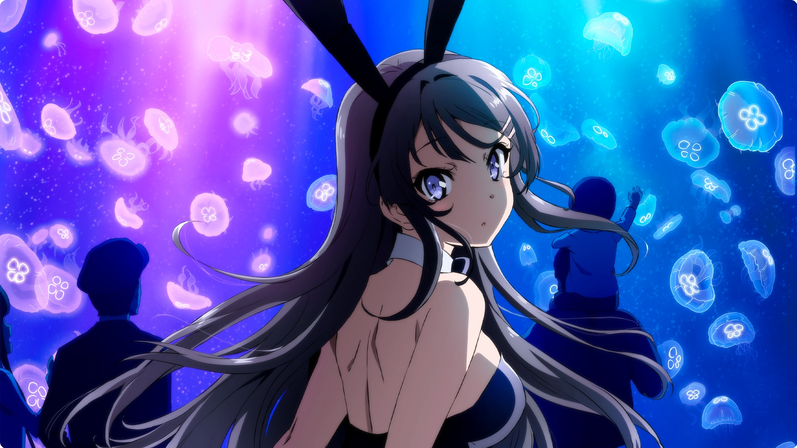

<div align="center">
  
  <h1>RDNDO</h1>
  <p>Fan-site dédié à <strong>Rascal Does Not Dream of Bunny Girl Senpai</strong></p>

  
  
  [](https://twingophase1.github.io/rdndo/)
</div>

---

## 📝 Présentation du Projet

Bienvenue sur le projet **RDNDO**, un site web immersif dédié à l'univers de la série animée et des light novels **"Rascal Does Not Dream of Bunny Girl Senpai"** (Seishun Buta Yarou).

Ce site a pour objectif de présenter en détail :
*   🌪️ **L'histoire globale** et les thèmes abordés, notamment le "Syndrome de la Puberté".
*   📖 **Les Arcs narratifs** : Une exploration détaillée de chaque arc (Arc 1, Arc 2, Arc 3...).
*   👥 **Les Personnages** : Des fiches complètes sur Sakuta Azusagawa, Mai Sakurajima, et les autres protagonistes.

Le site inclut également une page "About" originale et décalée, ajoutant une touche d'humour au projet.

## 📊 Gestion de Projet

Voici un aperçu du planning :

<a href="https://twingophase1.github.io/rdndo/Gestion%20de%20projet/Feuille%201.html">
  
</a>

[](https://trello.com/invite/b/6914aaf86b0aaaad0e522971/ATTI1555b82c88b091e9310a152632bd84d84AC498DD/projet-site)

[**Accéder au Tableau de Bord Trello**](https://trello.com/invite/b/6914aaf86b0aaaad0e522971/ATTI1555b82c88b091e9310a152632bd84d84AC498DD/projet-site)

## 🛠️ Technologies Utilisées

*   **HTML5** : (`index.html`, `charact.html`, `story.html`, `arc*.html`).
*   **CSS3** :
    *   **Flexbox** pour des mises en page fluides.
    *   **Variables CSS** et styles globalisés (`global.css`) pour une maintenance aisée.
    *   **Animations** (effets de brillance, transitions) pour dynamiser l'expérience utilisateur.
    *   **Responsive Design** pour une compatibilité mobile, tablette et desktop.
*   **Google Fonts** : *'M PLUS 1p'* et *'Roboto'* pour une identité visuelle forte.
*   **FontAwesome** : Icônes vectorielles pour l'interface.

## 📂 Structure du Projet

```
rdndo/
├── index.html        # Page d'accueil
├── story.html        # Présentation de l'histoire
├── charact.html      # Page des personnages
├── arc1.html         # Détail de l'Arc 1
├── arc2.html         # Détail de l'Arc 2
├── about.html        # Page 'A propos'
├── css/              # Feuilles de styles
│   ├── style.css
│   └── global.css
└── img/              # Images et assets
```

## 🌐 Hébergement

Le projet est déployé grâce à **GitHub Pages**.

🔗 **Visiter le site :** [https://twingophase1.github.io/rdndo/](https://twingophase1.github.io/rdndo/)
